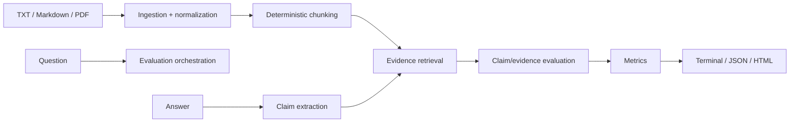

# Architecture

EvidenceBench uses a small pipeline with typed dataclasses as the boundaries between stages:

## Modules

- `ingestion.py`: validates paths, applies a file-size limit, reads UTF-8 text, optionally extracts PDF pages, and preserves only locations known by the source format.
- `chunking.py`: splits paragraphs into bounded chunks. Text and Markdown chunks carry line ranges and nearest headings; PDF chunks stay on their source page.
- `claims.py`: defines the `ClaimExtractor` protocol and ships a conservative syntax-based segmenter.
- `retrieval.py`: defines the `EvidenceRetriever` protocol and ships deterministic token-overlap retrieval.
- `evaluation.py`: defines the baseline claim evaluator and composes extraction, retrieval, and evaluation into an `EvaluationResult`.
- `metrics.py`: calculates rates from statuses and enforces CI thresholds. It does not inspect raw text.
- `reports.py`: renders a result without changing it. HTML escapes all user/source text and has no JavaScript.
- `providers.py`: vendor-neutral `LLMProvider` and `EmbeddingProvider` protocols. No SDK is installed by the core package.
- `benchmark.py`: validates the original dataset and computes runtime metrics from actual executions.
- `cli.py`: performs file I/O and maps expected failures to useful messages and exit codes.

## Deterministic versus model-dependent behavior

The default implementation is deterministic: ingestion, normalization, chunking, claim segmentation, lexical retrieval, evaluation heuristics, metrics, and reports make no network calls. This makes tests and CI reproducible.

Model-dependent operations are intentionally behind protocols. An application can implement `LLMProvider.extract_claims` or `LLMProvider.evaluate_claim`, or use `EmbeddingProvider` for retrieval, but it must make the provider and data flow explicit. `ProviderConfiguration` can be recorded in a report by an integrator.

## Data flow and immutability

The pipeline passes tuples of immutable dataclasses (`Document`, `Chunk`, `Claim`, `Evidence`, and `ClaimEvaluation`). Metadata dictionaries are copied at construction boundaries where application code creates objects. Reporters serialize an existing `EvaluationResult`; they never perform a second retrieval or evaluation.

## Extension points

1. Implement `ClaimExtractor` for a model-backed claim splitter.
2. Implement `EvidenceRetriever` for embeddings, BM25, or a user-supplied retrieval set.
3. Implement a claim evaluator that returns the same four statuses and retains evidence and rationale.
4. Keep model/provider names and remote-data behavior in result metadata.

Extensions should preserve the distinction between evidence, model judgment, uncertainty, and fact. A provider must not treat source-document text as instructions.
